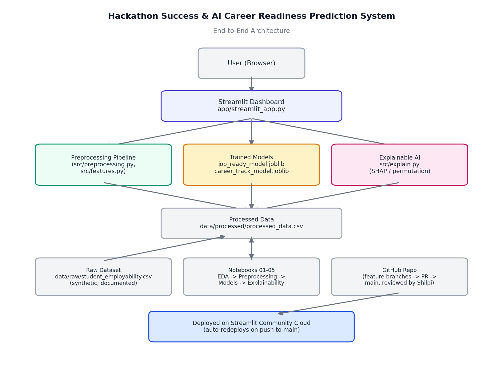

# Hackathon Success & AI Career Readiness Prediction System

*Do hackathons actually improve employability in ML/AI? We built a machine
learning system to let the data answer — not assumptions.*



## What this project does

Predicts whether a learner is **job-ready** for an entry-level Data/AI
role, and recommends the most suitable **career track** (Data Analyst,
Data Scientist, ML Engineer, Deep Learning Engineer, GenAI Engineer, or
Not Yet Ready) — based on skills, projects, deployment experience,
internships, interview performance, and hackathon history.

**Core principle:** hackathon participation is treated as evidence of
exposure and problem-solving practice — not, by itself, proof of
expertise. The trained model determines how much weight hackathons
deserve relative to everything else; nothing is scripted to reach a
predetermined conclusion. See [`data/README_DATA.md`](data/README_DATA.md)
for the full data-integrity notes (the current dataset is synthetic).

## Team

| Person | Role |
|---|---|
| **Shilpi** (Lead) | Project Manager, ML Integration, Dashboard Deployment |
| **Priyanshu** | Data Engineer, EDA, backend, SQL server |
| **Dushyant** | ML Engineer, Evaluation, Explainable AI |
| **Vedika** | Documentation,  |

Full responsibility breakdown: see [Team Responsibilities](#team-responsibilities) below.

## Live demo

- **App:** `[add your deployed Streamlit URL here after deployment]`
- **Repo:** `[[add your GitHub repo URL here](https://github.com/priyanshupanchal/Hackathon-job-prediction)]`

## Quickstart

```powershell
# 1. Clone and enter the repo
git clone https://github.com/<you>/hackathon-employability-ml.git
cd hackathon-employability-ml

# 2. Set up environment
python -m venv venv
.\venv\Scripts\Activate.ps1
pip install -r requirements.txt

# 3. Generate data, preprocess, train
python src/generate_dataset.py
python src/preprocessing.py
python src/train.py

# 4. Run tests
pytest tests/

# 5. Launch the dashboard
streamlit run app/streamlit_app.py
```

The app opens at `http://localhost:8501`.

## Project structure

```
hackathon-employability-ml/
├── data/
│   ├── raw/student_employability.csv       # synthetic dataset
│   ├── processed/processed_data.csv        # after cleaning + feature engineering
│   └── README_DATA.md                      # data integrity disclosure
├── notebooks/
│   ├── 01_eda.ipynb                        # exploratory data analysis
│   ├── 02_preprocessing.ipynb              # pipeline walkthrough
│   ├── 03_baseline_models.ipynb            # dummy + logistic regression baselines
│   ├── 04_model_comparison.ipynb           # full model comparison + tuning
│   └── 05_explainability.ipynb             # SHAP/permutation importance + error analysis
├── src/
│   ├── generate_dataset.py                 # synthetic data generator
│   ├── features.py                         # feature engineering
│   ├── preprocessing.py                    # cleaning + ColumnTransformer pipeline
│   ├── train.py                            # model training, CV, tuning
│   ├── evaluate.py                         # metrics + error analysis
│   ├── explain.py                          # explainability (SHAP w/ fallback)
│   └── predict.py                          # single-student inference (used by the app)
├── models/                                 # saved pipeline + trained models (generated)
├── app/
│   └── streamlit_app.py                    # the dashboard
├── tests/
│   ├── test_preprocessing.py
│   └── test_predict.py
├── docs/
│   ├── deployment.md                       # Streamlit Cloud deployment guide
│   ├── github_workflow.md                  # branch/PR workflow for the team
│   ├── demo_script.md                      # presentation script
│   ├── viva_questions.md                   # Q&A prep
│   ├── resume_bullets.md
│   ├── linkedin_caption.md
│   └── assets/architecture_diagram.png
├── data_dictionary.csv
├── requirements.txt
├── .gitignore
└── LICENSE
```

## Results (held-out test set)

Exact numbers are saved in `models/model_metadata.json` after you run
`src/train.py` — they will vary slightly depending on the random dataset
generated, but on our run:

| Target | Model | Accuracy | ROC-AUC / Macro-F1 |
|---|---|---|---|
| `job_ready` (binary) | Random Forest (tuned) | ~74% | ROC-AUC ~0.82 |
| `career_track` (6-class) | Logistic Regression | ~65% | Macro-F1 ~0.53 |

**Explainability finding:** across both built-in feature importance and
permutation importance, `internship_months`, `end_to_end_projects`,
`avg_interview_readiness`, and `ml_score` consistently outrank
`hackathons_attended` and `hackathons_won` in driving the job-readiness
prediction. See `notebooks/05_explainability.ipynb` for the full ranking.

**Caveat:** this dataset is synthetic (see `data/README_DATA.md`), so
this demonstrates the *methodology* for answering the hackathon question
— not a real-world claim about hiring. Swap in real, anonymized data and
the same pipeline applies unchanged.

## Team Responsibilities

### Shilpi — Team Leader (Project Manager + ML Integration + Deployment)
- Finalized architecture, managed GitHub repo, reviewed all PRs
- Integrated all modules, built the Streamlit dashboard
- Handled cloud deployment, final README, final testing, demo prep

### Vadika — Data Engineer (EDA + Preprocessing)
- Built and documented the dataset (`data_dictionary.csv`)
- Data cleaning, EDA (`01_eda.ipynb`), preprocessing pipeline
- Feature engineering (`src/features.py`), leakage prevention

### Dushant — ML Engineer (Evaluation + Explainable AI)
- Trained and compared baseline + advanced classification models
- Cross-validation, hyperparameter tuning, binary + multi-class evaluation
- Implemented explainability (permutation importance / SHAP), error analysis

## Important disclaimer

This tool produces an **estimated probability based on training data and
model assumptions**. It is **not a guarantee of employment**. Use it as
one input among many when planning your skill development — not as a
final verdict.

## License

MIT — see [LICENSE](LICENSE).
